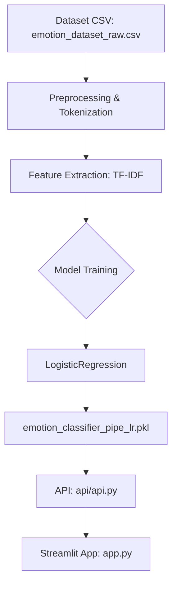

# Sentiment Analysis AI

## 📝 Overview

This project implements a machine learning pipeline with a **Flask API** deployed on **Render** and a **Streamlit app** for user interaction. The project is fully automated using GitHub Actions.

---

## 🚀 Deployed Applications

- **API on Render**: [https://sentiment-analysis-ai-f8je.onrender.com](https://sentiment-analysis-ai-f8je.onrender.com)
- **Streamlit App**: [https://sentiment-analysis-ai.streamlit.app](https://sentiment-analysis-ai.streamlit.app)

---

## 🎨 Project Presentation

View the complete project presentation on Canva:

- **Presentation**: [https://www.canva.com/design/DAGmD-htp94/JOvPJjGVcCaQ78ZciYyq_g/view?utlId=h6bb666b1fb](https://www.canva.com/design/DAGmD-htp94/JOvPJjGVcCaQ78ZciYyq_g/view?utlId=h6bb666b1fb)

---

## 📊 Project Workflow Diagram

Below is the workflow diagram for the Sentiment Analysis AI project:



---

## 🗂 Project Structure

```file.txt
Sentiment-Analysis-AI/
├── api/
│   ├── api.py
│   ├── requirements.txt
├── app.py
├── models/
│   └── emotion_classifier_pipe_lr.pkl
├── train_models.py
├── requirements.txt
├── README.md
└── data/
    └── emotion_dataset_raw.csv
```

---

## 🛠 Setup and Installation

### Prerequisites

- Python 3.9
- Git
- Accounts on [GitHub](https://github.com), [Render](https://render.com), and [Streamlit Sharing](https://share.streamlit.io)

### Local Installation

1. Clone the repository:

   ```bash
   git clone https://github.com/SannketNikam/Emotion-Detection-in-Text.git
   cd Sentiment-Analysis-AI
   ```

2. Create a virtual environment:

   ```bash
   python -m venv venv
   source venv/bin/activate  # On Windows: venv\Scripts\activate
   ```

3. Install dependencies:

   ```bash
   pip install -r requirements.txt
   ```

4. Train the models:

   ```bash
   python train_models.py
   ```

5. Run the API locally:

   ```bash
   cd api
   python api.py
   ```

6. Run the Streamlit app locally:

   ```bash
   streamlit run app.py
   ```

---

## 🚀 Deployment

### 1. Deploy the API on Render

1. Go to [Render](https://render.com/) and create a new **Web Service**.
2. Connect your GitHub repository.
3. Configure the service:
   - **Build Command**: `pip install -r requirements.txt`
   - **Start Command**: `python api.py`
4. Deploy the service.

### 2. Deploy the Streamlit App on Streamlit Sharing

1. Go to [Streamlit Sharing](https://share.streamlit.io/).
2. Connect your GitHub repository.
3. Specify the path to your Streamlit file (`app.py`).
4. Deploy the app.

---

## 🤖 GitHub Actions Workflow

The GitHub Actions workflow automates the following steps:

1. **Train Models**: Runs `train_models.py` to generate `.pkl` files.
2. **Deploy API**: Deploys the API to Render.

### `.github/workflows/ci_cd.yml`

```yaml
name: CI/CD Pipeline

permissions:
  contents: write

on:
  push:
    branches:
      - main
    paths:
      - "train_models.py" # Déclenche uniquement si ce fichier change
      - ".github/workflows/ci_cd.yml" # Déclenche uniquement si ce fichier change
  pull_request:
    branches:
      - main
    paths:
      - "train_models.py" # Déclenche uniquement si ce fichier change
      - ".github/workflows/ci_cd.yml" # Déclenche uniquement si ce fichier change

jobs:
  train-models:
    runs-on: ubuntu-latest
    steps:
      - name: Checkout repository
        uses: actions/checkout@v4
        with:
          ref: main
          fetch-depth: 0 # Ensures full history so Git can push

      - name: Set up Python
        uses: actions/setup-python@v5
        with:
          python-version: "3.9"

      - name: Install dependencies
        run: |
          python -m pip install --upgrade pip
          pip install -r requirements.txt

      - name: Create models directory
        run: |
          mkdir -p models

      - name: Train and save models
        run: |
          python train_models.py  # Exécute le fichier d'entraînement

      - name: Check if model file exists and diff
        run: |
          ls -l models
          git status
          git diff models/emotion_classifier_pipe_lr.pkl || echo "No diff"

      - name: Commit and Push models
        run: |
          git config --global user.name "GitHub Actions"
          git config --global user.email "actions@github.com"
          git config --global --add safe.directory "$GITHUB_WORKSPACE"
          git remote set-url origin https://x-access-token:${{ secrets.GITHUB_TOKEN }}@github.com/${{ github.repository }}.git
          git add models/emotion_classifier_pipe_lr.pkl
          git status
          git diff --cached || echo "No diff in staged files"
          git commit -m "Update models via GitHub Actions" || echo "No changes to commit"
          git push origin main || echo "No changes to push"

  deploy-api:
    needs: train-models
    runs-on: ubuntu-latest
    steps:
      - name: Checkout repository
        uses: actions/checkout@v4

      - name: Set up Python
        uses: actions/setup-python@v5
        with:
          python-version: "3.9"

      - name: Install dependencies
        run: |
          python -m pip install --upgrade pip
          pip install -r api/requirements.txt

      - name: Deploy to Render using API
        run: |
          pip install requests
          SERVICE_ID="${{ secrets.RENDER_SERVICE_ID }}"
          API_TOKEN="${{ secrets.RENDER_TOKEN }}"
          curl -s -X POST \
            -H "Authorization: Bearer $API_TOKEN" \
            -H "Accept: application/json" \
            -H "Content-Type: application/json" \
            -d '{
                  "clearCache": "do_not_clear"
                }' \
            "https://api.render.com/v1/services/$SERVICE_ID/deploys"
```

---

## 📄 Additional Documentation

### Key Files

- **`train_models.py`**: Script to train and save models.
- **`api/api.py`**: Flask API code.
- **`app.py`**: Streamlit app code.
- **`requirements.txt`**: Dependencies for the local environment.

---

## 🙏 Acknowledgments

- **Render** for hosting the API.
- **Streamlit Sharing** for hosting the Streamlit app.
- **GitHub Actions** for automating the CI/CD pipeline.
